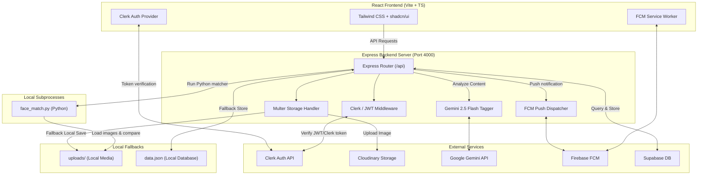

# Snapshare Event Manager

A premium full-stack web application designed for clubs, organizers, and members to manage event albums, upload and share high-quality media, discover photos, and leverage AI analysis and face recognition.

---

## 🏗️ System Architecture

The diagram below details the client-server architecture, local subprocesses (Python face matcher), database interactions (Supabase + Local fallback), and external API integrations (Clerk, Cloudinary, Gemini, FCM):



---

## 🛠️ Technology Stack

The application is built using a modern full-stack web engineering stack:

### Frontend
* **Core Framework**: React 19 (TypeScript)
* **Build System**: Vite v7
* **Styling**: Tailwind CSS v4 + Lucide Icons (lucide-react)
* **UI Components**: shadcn/ui (Radix Primitives)
* **Client Auth**: `@clerk/clerk-react`
* **HTTP Client**: Axios (configured with interceptors and upload progress event listeners)
* **Client Encryption**: Web Crypto API (SubtleCrypto for client-side SHA-256 hashing)

### Backend
* **Runtime**: Node.js (Express.js)
* **File Processing & Uploads**: Multer middleware
* **Image Processing**: Jimp (Java Image Manipulation Program in pure Javascript)
* **Process Manager**: Child Process (`spawnSync` to execute Python subprocesses)
* **Server Auth**: `@clerk/clerk-sdk-node` + `jsonwebtoken` (JWT fallback verification)

### Databases & Cloud Services
* **Database**: Supabase (PostgreSQL Database Engine) with secondary local JSON file storage fallback (`server/data.json`)
* **Media Storage / CDN**: Cloudinary Media Storage with secondary local disk storage fallback (`server/uploads/`)
* **AI Platform**: Google GenAI Node SDK (using `gemini-2.5-flash` model)
* **Push Notifications**: Firebase Admin SDK (Firebase Cloud Messaging - FCM)

---

## 🌟 Features & Technical Workflows

Here is an elaboration of each key feature and the specific technology stack utilized for implementation:

### 1. Custom Album Cover Image Selection
* **Description**: Allows administrators and photographers to specify the outer cover thumbnail when creating a new event. The cover can be chosen from a curated preset matching the category, a custom web URL, or an uploaded image file.
* **Frontend Tech Stack**: 
  * React `useState` hooks to manage selected cover mode (`preset` | `url` | `upload`), custom URL fields, files, and preview URLs (`URL.createObjectURL`).
  * Axios configured with `Content-Type: multipart/form-data` sending standard text fields and optional files compiled inside a `FormData` object.
* **Backend Tech Stack**:
  * Multer's `upload.single("thumbnail")` middleware to parse incoming files.
  * Conditional fallback router resolving: uploaded file path -> user URL parameter input -> pre-configured category Unsplash presets.

### 2. Duplicate Image Upload Prevention
* **Description**: Prevents bloating database and cloud storage by checking if a photo being uploaded already exists in the target album.
* **Frontend Tech Stack**:
  * Web Crypto API (`crypto.subtle.digest`) computes a client-side SHA-256 hash of the files before transmission.
  * Hashed tags are appended to the payload.
* **Backend Tech Stack**:
  * DB query verifies if the tag `hash:<sha256>` already exists inside the media records of the matching `eventId`.
  * If a duplicate is found, the server immediately halts the database entry and purges the file from local storage or Cloudinary, notifying the client.

### 3. Visual Upload Progress Indicators
* **Description**: Provides premium visual feedback indicating the upload completion rate in real-time when uploading media files.
* **Frontend Tech Stack**:
  * Axios `onUploadProgress` listener tracks total bytes and uploaded bytes.
  * Custom shimmering CSS progress animations (`animate-shimmer` inside vanilla CSS) visually render progress bars.

### 4. Smart AI Auto-Tagging
* **Description**: Automatically analyzes photographs on upload to generate descriptive metadata tags.
* **Backend Tech Stack**:
  * `@google/genai` Node.js client sdk sending images as base64 inline data blocks to the `gemini-2.5-flash` model.
  * Safe fallback regex parser resolving to category presets if the AI model is offline.

### 5. Dynamic Watermarked Downloads
* **Description**: Protects creator assets by adding dynamic, transparent, role-based watermarks when non-admin/non-photographer users download photos.
* **Backend Tech Stack**:
  * Jimp library loaded on the Express server.
  * Dynamically renders custom fonts, prints text parameters (e.g. Club Name, Event Name, and Date), applies an opacity mask, and streams the finished file as a buffer back to the client.

### 6. Performance-Throttled Discover Page
* **Description**: A smooth, infinite-scrolling photo discovery library using Unsplash and Lorem Picsum APIs.
* **Frontend Tech Stack**:
  * IntersectionObserver API monitoring a `discover-sentinel` div.
  * Tailwind `min-h-[280px]` height reserves placeholder boxes to prevent card collapses.
  * Custom `setTimeout` throttling blocks double-triggering network calls.

---

## ⚙️ Environment Configuration

Create a `.env` file inside the `server/` directory and configure the following variables:

```ini
# Clerk Authentication Config
CLERK_PUBLISHABLE_KEY=your_clerk_publishable_key
CLERK_SECRET_KEY=your_clerk_secret_key

# Supabase Database Config
SUPABASE_URL=your_supabase_url
SUPABASE_SERVICE_ROLE_KEY=your_supabase_secret_key

# Cloudinary Storage Config
CLOUDINARY_CLOUD_NAME=your_cloudinary_cloud_name
CLOUDINARY_API_KEY=your_cloudinary_api_key
CLOUDINARY_API_SECRET=your_cloudinary_api_secret

# Google Gemini API Config
GEMINI_API_KEY=your_gemini_api_key

# Firebase Cloud Messaging Config
FIREBASE_SERVICE_ACCOUNT_PATH=./server/serviceAccountKey.json
FCM_VAPID_KEY=your_fcm_vapid_key
```

And in the project root folder `.env` (frontend):
```ini
VITE_CLERK_PUBLISHABLE_KEY=your_clerk_publishable_key
VITE_SUPABASE_URL=your_supabase_url
VITE_SUPABASE_ANON_KEY=your_supabase_anon_key
VITE_FCM_VAPID_KEY=your_fcm_vapid_key
```

---

## 🚀 Development and Setup

### Installation
```bash
npm install --legacy-peer-deps
npm run setup
```

### Local Development
To run the frontend and backend server concurrently:
```bash
npm run dev:all
```
* Frontend will run at `http://localhost:5173/`
* Backend API will run at `http://localhost:4000/`

---

## 🌐 Production Deployment

The application is configured to run as a single unified service. The Express backend serves the compiled React static assets directly.

### Steps to Build and Run in Production:
1. **Compile Production Frontend Assets**:
   ```bash
   npm run build
   ```
   This will output the compiled assets inside the `/dist` directory.
2. **Start the Production Unified Server**:
   ```bash
   npm start
   ```
3. Access the complete full-stack application at `http://localhost:4000`.
